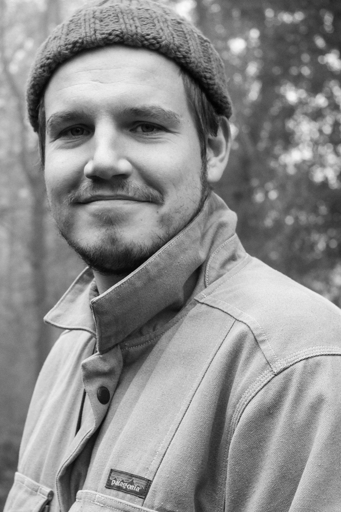

I began my career at Liverpool John Moores University, at the Astrophysics Research Institute, under the supervision of Ricardo Schiavon and Rob Crain. My PhD focused on understanding the (then) novel results of observational surveys of the structure - chemically, spatially and kinematically - of the Milky Way. I used the EAGLE suite of cosmological simulations to demonstrate that the element abundances of the Milky Way disc may provide deep insights into its assembly over cosmic time.

Since then, I have been beating the path toward understanding the Milky Way in a truly _cosmological_ context. This requires the synthesis of observations and theory at all scales in astrophysics. As a postdoctoral fellow at the University of Birmingham, I focused on driving down the precision and accuracy of the ages of the oldest stars in the Milky Way halo, where the evidence of Galactic assembly is rife. Our group made the first measurements of the ages of stars which were accreted to the Milky Way early in its history (so you might say we made the first extra-Galactic stellar age measurement!).

At the University of Toronto, I am continuing to work towards making detailed measurements of the structure and evolution of the Milky Way. As a Banting Fellow, I am using these constraints to predict how the younger siblings of the Milky Way -- galaxies which will eventually evolve to become like it -- will appear among the rest of the distant galactic population. I am also helping to plan a survey of the Galactic halo as part of the SDSS-V Milky Way Mapper project, which will survey stars from the smallest and earliest dwarf galaxies which were accreted to the Milky Way. 

{:width="30%" .center-image}
