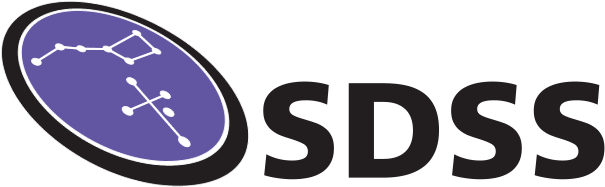

# SDSS Milky Way as a Galaxy Symposium Series
## Symposium II: Radial migration in disk galaxies

## 10th Nov 2021 - 14:00-17:00 EDT
**Zoom info TBC - please register your interest using this form:**
[Registration Form](https://docs.google.com/forms/d/e/1FAIpQLSc49tbvAezA9qQ6kJsqj9UdVq_CYSRAMmXqpSAI_FHfdvjqcQ/viewform)

[Add event to your Calendar](./assets/ics/mwagsymp2.ics)

This is the second of a series of symposia organised by the SDSS IV Milky Way as a galaxy (MWAG) working group, intended to promote science and discussion in and around the theme of understanding the context of the Milky Way within the broader realm of galaxy formation and evolution.

The scope of these symposia is to bring MWAG science out of telecons and into a more widely accessible domain and to trigger new ideas and discussion. The format will be three science talks, ~20(+10) minutes in length, followed by a 30 minute structured discussion. We expect to also hold a 'speed-geeking' session during the symposium, aimed at facilitating discussion and networking between Milky Way-focused and extra-Galactic-focused researchers.

This symposium will focus on **the physics and effects of radial migration in galaxy disks and what it can tell us about galaxy formation**. We have three invited speakers (click the dropdown for abstracts):

**Where is radial migration seen in the data and how we can quantify it from observations?**
*Dr. Jianhui Lian (MPIA, Heidelberg)*

 Abstract 

ABSTRACT TBC!

**What do we mean by "radial migration" in simulations?**
*Prof. Sarah Loebman (UC Merced, California)*

 Abstract 

ABSTRACT TBC!

**How does "radial migration" work and in what scenarios is it efficient?**
*Prof. Kate Daniel (Bryn Mawr College, Pennsylvania)*

 Abstract 

ABSTRACT TBC

*To be followed by a discussion and chaired jointly by Ted Mackereth and Nick Boardman, MWAG co-chairs*

Talks will be recorded and uploaded to an unlisted YouTube link, which will be shared following the meeting to those who register interest.

Please note that the symposium is intended for members of the SDSS IV and V collaboration and will have discussion focused on how the surveys within them can provide new insight on the problems. However, attendance by non-members is permissible with their agreement to commit to and abide by the [SDSS non-disclosure agreement](https://internal.sdss.org/meetings/ensenada2019/static/pdf/nonmember_attendance.pdf). Completion of the regsitration form and attendance will bind you to these terms.

All symposium attendees will be bound by the [SDSS Code of Conduct](https://www.sdss.org/collaboration/the-sloan-digital-sky-survey-code-of-conduct/).
